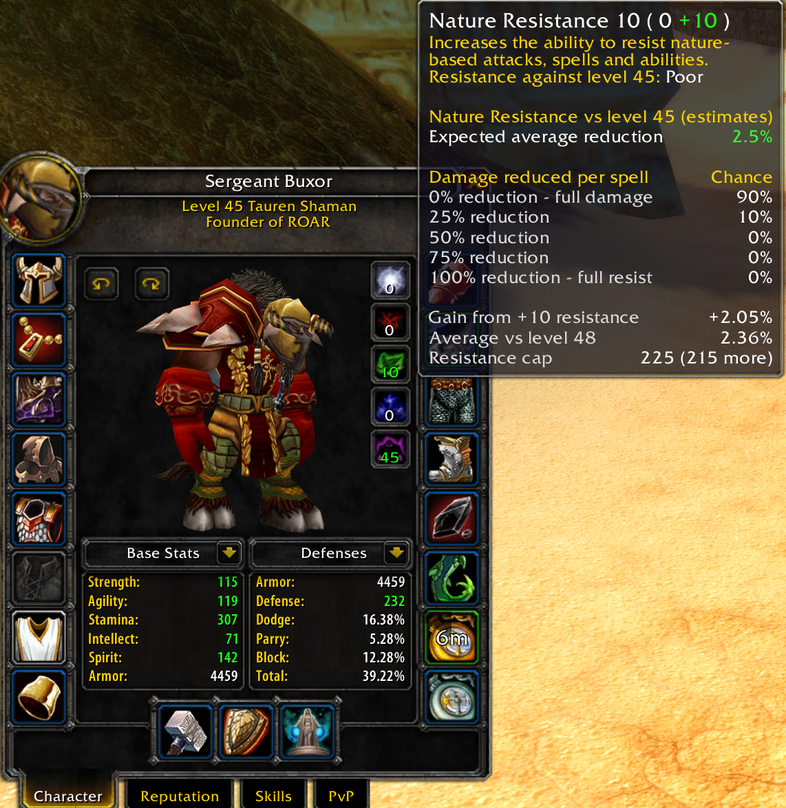
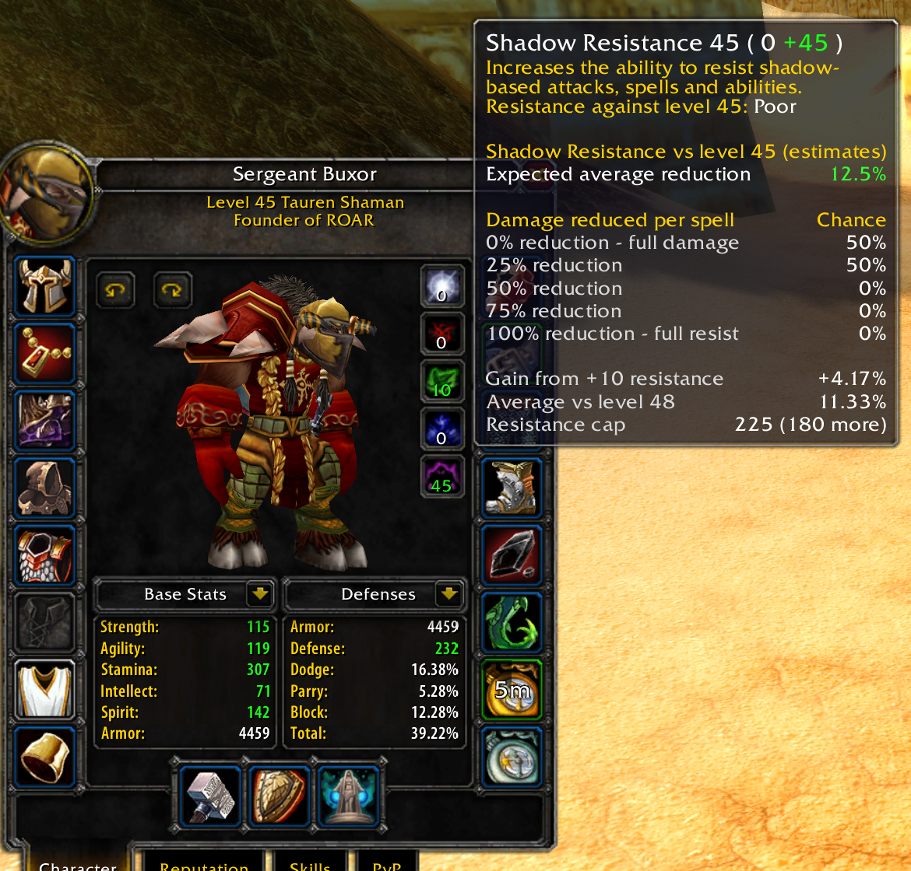

# BuxbrewResist

See what your resistance stats could mean in combat. BuxbrewResist adds estimated damage reduction and partial-resist chances to the resistance tooltips in your character panel. You can also check your stats in chat with `/buxres`.

Designed for the WoW 1.12 / TurtleWoW client.

## Installation

1. **Exit the game completely.** If you already copied the addon while the game was running, close the game and start it again.
2. Place the `BuxbrewResist` folder inside your game's `Interface\AddOns` folder. The files should be directly inside it:

   ```text
   Interface\AddOns\BuxbrewResist\BuxbrewResist.toc
   Interface\AddOns\BuxbrewResist\BuxbrewResist.lua
   ```

3. Start the game. At character selection, click **AddOns** and make sure **BuxbrewResist** is enabled.
4. Log in and open your character panel to try it.

**Installing a new addon requires a full game restart.** `/reload` refreshes addons the client already knows about; it does not make a newly installed addon appear. Logging out to character selection is not enough either.

If BuxbrewResist is missing from the AddOns list, check that you installed it in the same game folder you launch and that there is no extra folder around it (such as `BuxbrewResist\BuxbrewResist\BuxbrewResist.toc`). Then restart the game.

For edits to the Lua code of an addon that is already loaded, `/reload` is enough. After installing an update, a full restart is the simplest way to ensure all changes are picked up.

## Using the addon

Open your character panel (normally **C**) and hover over **Arcane, Fire, Nature, Frost, or Shadow** resistance. BuxbrewResist adds a section below the normal game tooltip. Stats are read each time you hover, so move your mouse away and back after changing gear or buffs.

The added section shows:

- **Expected average reduction:** the estimated damage reduction across many spells, highlighted in green. It does not mean every spell loses that much damage.
- **Damage reduced per spell / Chance:** the estimated chances of taking full damage or resisting 25%, 50%, 75%, or all of a spell's damage.
- **Gain from +10 resistance:** how much the estimated average would increase with another 10 resistance. This is a percentage-point gain: going from 20% to 23% is a gain of 3 points, shown as `+3%`.
- **Average vs level +3:** the estimate against an attacker three levels above you.
- **Resistance cap:** the cap used by the model against an attacker of your level, followed by how much more resistance you need to reach it.

The main estimate assumes an attacker at your level. **Negative resistance shows a negative reduction in red**, plus an **Extra damage taken (estimate)** row. For example, at level 60, -30 Fire resistance gives an estimated -10% reduction: a 100-damage Fire hit would become 110 damage before other modifiers. The partial-resist table is hidden while resistance is negative.

## Chat commands

| Command | What it does |
| --- | --- |
| `/buxres` | Shows an overview of your stats in chat. |
| `/buxres shadow` | Shows detailed estimates for Shadow resistance. |
| `/buxres fire` | Shows detailed estimates for Fire resistance. |
| `/buxres physical` | Shows the addon's armor-reduction calculation. |

Available names are `physical`, `holy`, `fire`, `nature`, `frost`, `shadow`, and `arcane`. Capitalization does not matter. Unique prefixes such as `sh` also work; use `fi` or `fr` to distinguish Fire from Frost. Physical and Holy have separate summaries rather than the magic partial-resist breakdown.

## Understanding the estimates

These numbers come from a legacy approximation, **not measured TurtleWoW server probabilities**. Treat them as a guide when comparing resistance values, not a guarantee of what the next spell will do. The binary-spell estimate in detailed chat output refers to an all-or-nothing resist model; it should not be read as a universal chance for every damage-over-time or crowd-control spell.

For readers interested in the calculation, the model starts with `min(0.75, max(0, resistance / (5 * max(attackerLevel, 20)) * 0.75))`, builds a distribution of partial-resist outcomes, and weights each outcome by its chance. The displayed average can differ from that starting value. Chat, tooltips, and the +10 comparison use the same weighted-average calculation.

Implementation references:

For negative resistance, the vulnerability estimate is `resistance / (5 * max(playerLevel, 20))`. This follows the CMaNGOS Classic reference implementation: it uses your level and does not apply the positive-resistance formula's 0.75 multiplier. It is not confirmed for TurtleWoW. The same negative estimate is used in tooltips and chat.

- [Vanilla character resistance tooltip scripts](https://github.com/MOUZU/Blizzard-WoW-Interface/blob/master/1.12.1/FrameXML/PaperDollFrame.xml)
- [CMaNGOS Classic resistance implementation](https://github.com/cmangos/mangos-classic/blob/master/src/game/Entities/Unit.cpp), `CalculateEffectiveMagicResistancePercent` and `CalculateSpellResistChance`. This is a reference implementation, not confirmation of TurtleWoW's behavior.

## Screenshots

Nature resistance:



Shadow resistance:


